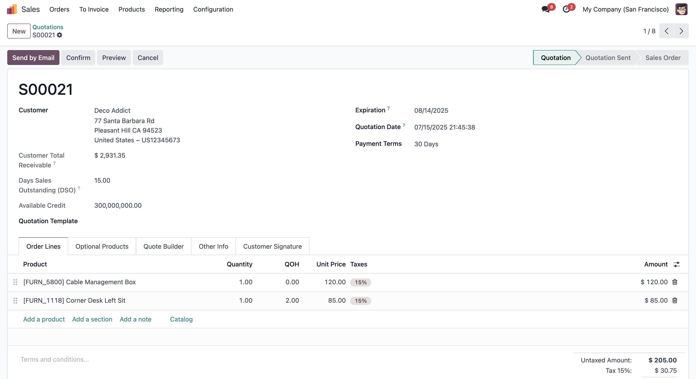

# Sale Customer Credit Limit

Displays the customer's credit limit and related financial information directly on the sale order form.

## Key Features

- Show customer credit limit on Sale Orders
- Displays available credit and Days Sales Outstanding (DSO)
- Provides instant credit visibility for the sales team

## Screenshots

## Installation

1. Add the module to your Odoo addons folder
2. Update the app list and install via Odoo Apps

## Author

Ismail Waxir

Contact: ismailwaxir@gmail.com
